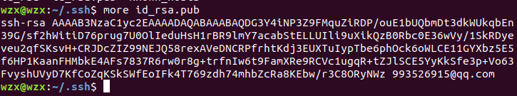
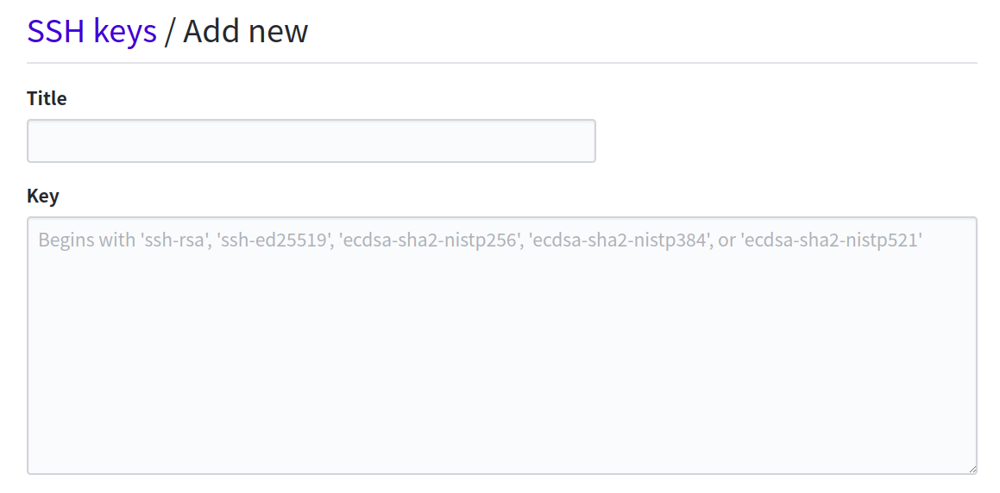
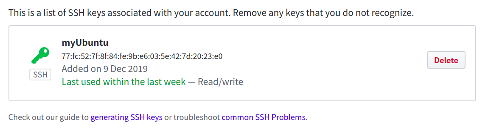
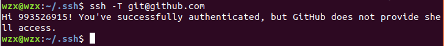
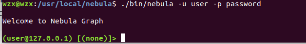
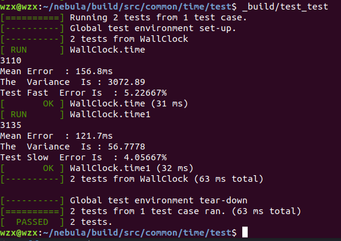
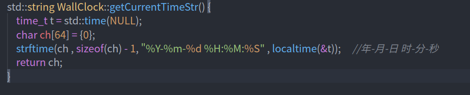
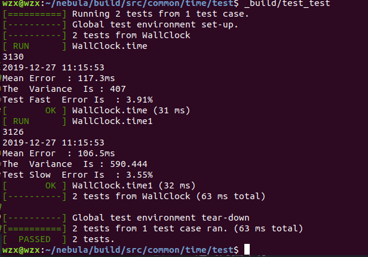
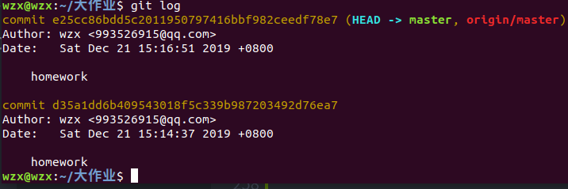

## C++期末大作业报告
姓名：王则翔      
学号:18062037
#### 简述
此次作业的主要内容是对github上的开源代码nebula进行单元测试，并用git提交到github上，以此来锻炼我们的代码阅读水平以及项目工程级代码规范以及操作要求。
## 过程描述
#### git的安装
git的安装非常简单，只需要一行命令即可安装
```
sudo apt install git 
```
输入完成之后再输入自己的电脑密码即可开始安装

#### git 环境配置
用git创建远程连接需要在github里创建秘匙
##### 第一步
```
ssh-keygen -t rsa -C "993526915@qq.com"
```
使用ssh创建秘匙
##### 第二步
```
cd  ~/.ssh
```
进入.ssh目录下
##### 第三步
```
more id_rsa.pub
```
在id_rsa.pub文件中找到秘匙

##### 第四步
将所有秘匙复制，并进入github，在左上角进入Settings-->SSH and GPG keys --> new ssh key 

将秘匙粘贴到Key中并保存

完成后会显示如下界面
最后，在终端输入
```
ssh -T git@github.com
```

这是远程访问github命令，若显示如图，则git成功连接github
#### nebula安装与启动
安装完git后就能用git从github上克隆代码到本地了
##### 第一步
进入nebula创建者的主页，fork到自己的主页下
```
git clone https://github.com/993526915/nebula.git
```
将代码拷贝到本地
##### 第二步
```
cd nebula
```
进入nebula文件夹
```
 ./build_dep.sh
```
安装依赖
```
source ~/.bashrc
```
```
mkdir build
```
创建build文件夹
```
cd build
```
进入build文件夹
```
cmake ..

make
```
等待一段时间直到完成

```
sudo make install
```
安装make下来的文件
```
cd /usr/local/nebula

bash> cp etc/nebula-graphd.conf.default etc/nebula-graphd.conf
bash> cp etc/nebula-metad.conf.default etc/nebula-metad.conf
bash> cp etc/nebula-storaged.conf.default etc/nebula-storaged.conf
```
这就配置完成了nebula

##### 启动nebula
```
bash> ./scripts/nebula.service start all
bash> ./bin/nebula -u user -p password --port 3699 --addr "127.0.0.1"
```
这两行命令用于启动nebula
当显示如图

表示启动完成

##### nebula使用
可以使用命令行来完成
创建tag edges和spaces等进行数据的储存与筛选

#### 源代码修改与编译
我在nebula/src/common/time/test文件夹下添加了名叫test.cpp的文件，并修改了cmakelist使得其在make后出现test_test文件

test.cpp
```c++

#include "base/Base.h"
#include <folly/Benchmark.h>
#include "time/Duration.h"
#include "time/WallClock.h"
#include "base/Base.h"
#include <gtest/gtest.h>
#include<vector>
#include<math.h>

 using nebula::time:: WallClock;

TEST(WallClock , time ) {

    std::vector<int64_t> timer;
    std::vector<int64_t>s;

    for (uint32_t i = 0; i < 10; i++) {

        auto sec=WallClock::fastNowInMicroSec();
        usleep(3000);
        auto sec2=WallClock::fastNowInMicroSec();
        auto cost_time=sec2-sec;
        timer.push_back(cost_time);
    }
    std::cout << timer[0] << std::endl;
    int64_t sum=std::accumulate(timer.begin(),timer.end(),0);
    double average=sum*1.0/10;
    std::cout << "Mean Error  : " << average-3000 << "ms "<<std::endl;

    for(int i = 0; i < 10 ; i++ ){
        int64_t a=(timer[i]-average)*(timer[i]-average);
        s.push_back(a);
    }

    int64_t sum2=std::accumulate(s.begin(),s.end(),0);
    double variance=sum2*1.0/9;
    std::cout << "The  Variance  Is : "<< variance << std::endl;
    double error=( abs(average-3000) * 1.0 / 3000) * 100;
    std :: cout << "Test Error Is  : " << error  << "%" << std::endl;

}

TEST(WallClock , time1 ) {

    std::vector<int64_t> timer;
    std::vector<int64_t>s;

    for (uint32_t i = 0; i < 10; i++) {

        auto sec=WallClock::slowNowInMicroSec();
        usleep(3000);
        auto sec2=WallClock::slowNowInMicroSec();
        auto cost_time=sec2-sec;
        timer.push_back(cost_time);
    }
    std::cout << timer[0] << std::endl;
    int64_t sum=std::accumulate(timer.begin(),timer.end(),0);
    double average=sum*1.0/10;
    std::cout << "Mean Error  : " << average-3000 << "ms "<<std::endl;

    for(int i = 0; i < 10 ; i++ ){
        int64_t a=(timer[i]-average)*(timer[i]-average);
        s.push_back(a);
    }

    int64_t sum2=std::accumulate(s.begin(),s.end(),0);
    double variance=sum2*1.0/9;
    std::cout << "The  Variance  Is : "<< variance << std::endl;
    double error=( abs(average-3000) * 1.0 / 3000) * 100;
    std :: cout << "Test Error Is  : " << error  << "%" << std::endl;

}

int main(int argc, char** argv) {

    testing::InitGoogleTest(&argc, argv);
    folly::init(&argc, &argv, true);
    google::SetStderrLogging(google::INFO);
    return RUN_ALL_TESTS();

}
```
这段代码是用来测试程序中代码的延迟，用到了WallClock类中的fastNowInMicroSec()函数计算usleep()函数的延迟误差，并给出了误差的均值以及延迟的方差。



这是编译结果并且从结果可以看出实验结果确实如同预料，slowNowIn比MicroSec()的速度比fastNowInMicroSec()的速度慢，但精确程度要高

编译结果得到验证，单元测试成功。


#### 实验心得
心得：
经过本次实验，我更加了解了git的使用，同时对个github的了解也提升了一个层面，我懂得了如何用git提交代码，以及如何用github的commit与源代码作者进行交流，此外，我对大项目的理解程度更上一层，我还懂得了如何月嗯cmake编译代码以及如何直接调用make完的代码。

遇到的困难有：
第一次fork下来的代码是老版本的代码，无法进行编译，之后通过老师的帮助得到了新的代码。

#### 修改 （12月27日11:10分）
在之前的操作之后我重新修改了大作业文档，并为工程添加了新的东西

##### 在WallClock.cpp添加新的函数std::string WallClock::getCurrentTimeStr()

此函数能够返回当前的北京时间年-月-日-时-分-秒。

测试代码

可见多出了代码运行的北京时间。


##### git提交代码到github
在之前的草错中我们已经从github fork了别人的代码。这样我们已经和我们fork下来的仓库建立了远程联系。
```
cd nebula
```
之后我们就可以进入到nebula文件夹中
```
git add .
```
将改动的部分添加到git暂存区域中
```
git commit -m "nebula"
```
将我们这次改动标记为nebula并且将暂存区里的改动给提交到本地的版本库
```
git push
```
这样子就能直接将代码改动提交到github上了

#### 进一步学习git
因为对git操作很感兴趣所以自己去学了下git的操作

##### git的增删改查
经过学习发现git是一个非常强大的工具，我们可以保存任何一个我们的改动并且还能还原被改动的操作，这样子在写代码的时候再也不用每次完成一项测试复制整个文件夹了。

###### 增
```
git add .
```


###### 查
```
git status
```
查看git的改动，每次修改文件后就能砍价哪几个文件被改动
```
git log
```
查看之前的git commit 的版本，以便之后的复原操作
```
git diff
```
对改动的文件进行系统性的查看，他能够精确的告诉你文件代码的哪一行被修改

###### 删
git的恢复功能我爱了，真**舒服
```
git log
```
首先查看git的版本号


```
git reset --hard d35a1dd6b409543018f5c339b987203492d76ea7
```
即可恢复当时保存的版本
```
git checkout
```
恢复上个版本

###### 改
在git中我们fork下来的并不能实时跟随作者更新，需要用命令行去更新。
```
git remote -v 
git remote add upstream git@github.com:xxx/xxx.git
git fetch upstream
git merge upstream/master
git push
```
这样我们就能实时更新作者的代码了

#### 遇到的问题
之前一直根新作者代码，但是历史版本不匹配无法更新，之后加上–allow-unrelated-histories参数，和并成功，但但在commit时候却出现171条错误，说不符合cpplint格式无法提交，这部应该啊，难道原作者commit时候没符合cpplint？？？
第二个问题就是cpplint格式不太熟练，不过之后经过改进会变得更好。

# request
希望老师给个高分，连续两天搞到凌晨三点不容易，之间因为git不熟练导致多次项目代码丢失，没能力找回只能重装。。。。。
现在至少能够熟练提交pr以及熟练使用git穿梭在任意版本以及熟练提交代码了。。。